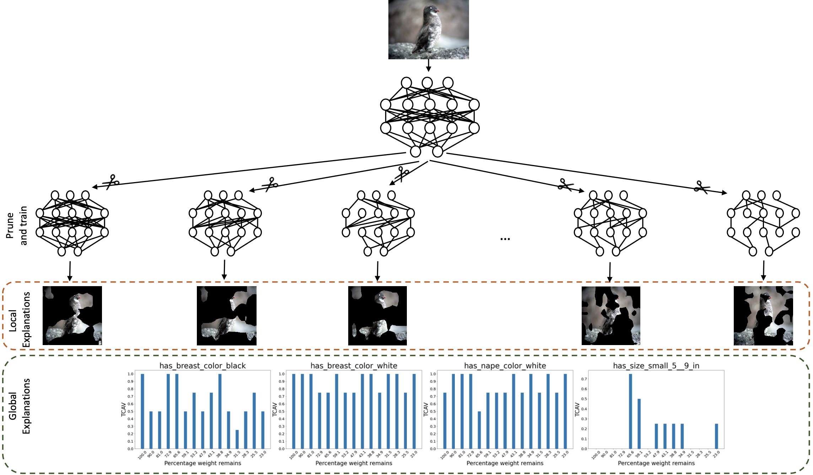

# Explaining why Lottery Ticket Hypothesis Works or Fails

## Objective:

Code for the course [CMU 16-824: Visual Learning and Recognition](https://visual-learning.cs.cmu.edu/). In this project,
we study the relationship between pruning and explainability. We validate if the explanations generated from the pruned
network using [Lottery ticket hypothesis](https://visual-learning.cs.cmu.edu/) (LTH) are consistent or not. Specifically
we prune a neural network using LTH. Next we generate and compare the local and global explanations
using [Grad-CAM](https://arxiv.org/pdf/1610.02391.pdf) and
[Concept activations](https://arxiv.org/abs/1711.11279) respectively. Overview of our method is as follows:


## Report

Follow the [link](https://github.com/Shantanu48114860/Explainability-with-LTH/blob/main/doc/VLR.pdf).

## Environment setup

Create the environment from the environment.yml file:

 ```bash
  conda env create -f environment.yml
 ```

## Dataset

#### CUB-200

* Download the CUB-200 dataset from the [link](https://www.vision.caltech.edu/datasets/cub_200_2011/)
* Preprocess the noisy concepts in the dataset using the following command:

 ```bash
cd scripts_data
python download_cub.py
```

#### MNIST

* Download and create the `even / odd` dataset using the following command:

 ```bash
 cd scripts_data
 python download_mnist_E_O.py
```

## Dataset splits

The train-test-val splits of all the datasets are given in the corresponding json files in the `scripts_data` directory.

## Hyperparameters

* For CUB-200, check `config/BB_cub.yml` file
* For MNIST Even / odd, check `config/BB_mnist.yml` file

## Steps to reproduce the results

* Prior to start the training process, edit `data_root`, `json_root` and `logs` parameters in the config
  file `config/BB_cub.yaml` to set the path of images, json files for train-test-val splits and the output to be saved
  respectively.
* Prior to follow the steps, refer to `./iPython/Cub-Dataset-understanding.ipynb` file to understand the CUB-200
  dataset. This step is optional.
* Preprocess the noisy concepts as described earlier.
* Follow the steps below for CUB-200 dataset:

#### Step 1: Train and prune

```bash
python main_lth_pruning.py --config "config/BB_cub.yaml"
```

#### Step 2: Test the pruned models to record the performance

```bash
python main_lth_test.py --config "config/BB_cub.yaml"
```

#### Step 3: Save the activations as image embeddings to train for CAVs

```bash
python main_lth_save_activations.py --config "config/BB_cub.yaml"
```

#### Step 4: Train classifier using the image embeddings to obtain CAVs

```bash
python main_lth_generate_cavs.py --config "config/BB_cub.yaml"
```

#### Step 5: Estimate TCAV score for the global explanations

Edit `labels_for_tcav` and `concepts_for_tcav` parameters in the file `config/BB_cub.yaml` for the desired class label
and concept label to generate the TCAV score for

```bash
python main_lth_tcav.py --config "config/BB_cub.yaml"
```

#### Step 6: Compute Grad-CAM based saliency maps for the local explanations

Edit `labels_for_tcav` parameter in the file `config/BB_cub.yaml` for the desired class label to generate the Grad-CAM
saliency maps. By default, we generate the saliency map for the 2nd image of the desired class in the test-set.

```bash
python main_heatmap_save.py --config "config/BB_cub.yaml"
```

#### Step 7: Generate plots

```bash
./iPython/Analysis-CUB_Test-GradCAM.ipynb
```

## Bash scripts

All the bash scripts to follow steps are included in `./bash_script` file.

## Pre-trained models

Get the pretrained models following
the [link](https://pitt-my.sharepoint.com/:f:/g/personal/shg121_pitt_edu/Ek4iVGotbGNItCghVxxys8cB0nLSe6Nage3OrGgeHHTJQw?e=iWkIc0)
. This link contains all check points of all the pre-trained pruned models for CUB-200 dataset. Download it and give the
path till `results` in `log` parameter `./config/BB_cub.yaml` file.

## Contact

shawn24@bu.edu (preferred), shg121@pitt.edu, beingshantanu2406@gmail.com (personal), shantan2@andrew.cmu.edu

Licensed under the [MIT License](LICENSE)
Copyright (c) [Shantanu](https://shantanu48114860.github.io/)
, 2021
